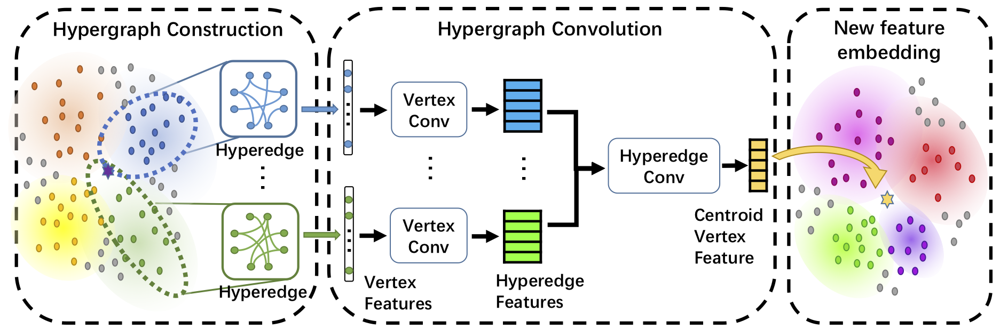

# DHGNN: Dynamic Hypergraph Neural Networks
Created by Jianwen Jiang, Yuxuan Wei, Yifan Feng, Jingxuan Cao and Yue Gao from Tsinghua University and Xiamen University.

## Introduction
This work has been published in IJCAI 2019.  
Dynamic Hypergraph Neural Networks (DHGNN) is a kind of neural networks modeling dynamically evolving hypergraph structures, which is composed of the stacked layers of two modules: dynamic hypergraph construction (DHG) and hypergrpah convolution (HGC). Considering initially constructed hypergraph is probably not a suitable representation for data, the DHG module dynamically updates hypergraph structure on each layer. Then hypergraph convolution is introduced to encode high-order data relations in a hypergraph structure. The HGC module includes two phases: vertex convolution and hyperedge convolution, which are designed to aggregate feature among vertices and hyperedges, respectively. We have evaluated our method on standard datasets, the Cora citation network and Microblog dataset. Detailed introduction can be found in [the original paper](https://www.ijcai.org/proceedings/2019/0366.pdf).  
In this repository, we release the code for train and test DHGNN on Cora citation dataset.
## Citation
```
@inproceedings{Jiang2019Dynamic,
  title={Dynamic Hypergraph Neural Networks},
  author={Jianwen Jiang, Yuxuan Wei, Yifan Feng, Jingxuan Cao and Yue Gao},
  booktitle={Proceedings of International Joint Conferences on Artificial Intelligence},
  page={2635-2641},
  year={2019}
}
```
## Installation
The code has been tested with Python 3.6, CUDA 9.0 on Ubuntu 16.04. GPU is needed to run the code. You can install all the requirements by `pip install -r requirements.txt`.  
Requirements list:
- alabaster==0.7.10
- asn1crypto==0.24.0
- astroid==1.6.3
- astropy==3.0.2
- attrs==18.1.0
- Babel==2.5.3
- backcall==0.1.0
- backports.shutil-get-terminal-size==1.0.0
- beautifulsoup4==4.6.0
- bitarray==0.8.1
- bkcharts==0.2
- blaze==0.11.3
- bleach==2.1.3
- bokeh==0.12.16
- boto==2.48.0
- Bottleneck==1.2.1
- certifi==2018.4.16
- cffi==1.11.5
- chardet==3.0.4
- click==6.7
- cloudpickle==0.5.3
- clyent==1.2.2
- colorama==0.3.9
- conda==4.5.4
- conda-build==3.10.5
- conda-verify==2.0.0
- contextlib2==0.5.5
- cryptography==2.2.2
- cycler==0.10.0
- Cython==0.28.2
- cytoolz==0.9.0.1
- dask==0.17.5
- datashape==0.5.4
- decorator==4.3.0
- distributed==1.21.8
- docutils==0.14
- entrypoints==0.2.3
- et-xmlfile==1.0.1
- fastcache==1.0.2
- filelock==3.0.4
- Flask==1.0.2
- Flask-Cors==3.0.4
- gevent==1.3.0
- glob2==0.6
- gmpy2==2.0.8
- greenlet==0.4.13
- h5py==2.7.1
- heapdict==1.0.0
- html5lib==1.0.1
- idna==2.6
- imageio==2.3.0
- imagesize==1.0.0
- ipdb==0.12.3
- ipykernel==4.8.2
- ipython==6.4.0
- ipython-genutils==0.2.0
- ipywidgets==7.2.1
- isort==4.3.4
- itsdangerous==0.24
- jdcal==1.4
- jedi==0.12.0
- jieba==0.39
- Jinja2==2.10
- jsonschema==2.6.0
- jupyter==1.0.0
- jupyter-client==5.2.3
- jupyter-console==5.2.0
- jupyter-core==4.4.0
- jupyterlab==0.32.1
- jupyterlab-launcher==0.10.5
- kiwisolver==1.0.1
- lazy-object-proxy==1.3.1
- llvmlite==0.23.1
- locket==0.2.0
- lxml==4.2.1
- MarkupSafe==1.0
- matplotlib==2.2.2
- mccabe==0.6.1
- mistune==0.8.3
- mkl-fft==1.0.0
- mkl-random==1.0.1
- more-itertools==4.1.0
- mpmath==1.0.0
- msgpack-python==0.5.6
- multipledispatch==0.5.0
- navigator-updater==0.2.1
- nbconvert==5.3.1
- nbformat==4.4.0
- networkx==1.11
- nltk==3.3
- nose==1.3.7
- notebook==5.5.0
- numba==0.38.0
- numexpr==2.6.5
- numpy==1.14.3
- numpydoc==0.8.0
- odo==0.5.1
- olefile==0.45.1
- openpyxl==2.5.3
- packaging==17.1
- pandas==0.23.0
- pandocfilters==1.4.2
- parso==0.2.0
- partd==0.3.8
- path.py==11.0.1
- pathlib2==2.3.2
- patsy==0.5.0
- pep8==1.7.1
- pexpect==4.5.0
- pickleshare==0.7.4
- Pillow==5.1.0
- pkginfo==1.4.2
- pluggy==0.6.0
- ply==3.11
- prompt-toolkit==1.0.15
- psutil==5.4.5
- ptyprocess==0.5.2
- py==1.5.3
- pycodestyle==2.4.0
- pycosat==0.6.3
- pycparser==2.18
- pycrypto==2.6.1
- pycurl==7.43.0.1
- pyflakes==1.6.0
- Pygments==2.2.0
- pylint==1.8.4
- pyodbc==4.0.23
- pyOpenSSL==18.0.0
- pyparsing==2.2.0
- PySocks==1.6.8
- pytest==3.5.1
- pytest-arraydiff==0.2
- pytest-astropy==0.3.0
- pytest-doctestplus==0.1.3
- pytest-openfiles==0.3.0
- pytest-remotedata==0.2.1
- python-dateutil==2.7.3
- pytz==2018.4
- PyWavelets==0.5.2
- PyYAML==3.12
- pyzmq==17.0.0
- QtAwesome==0.4.4
- qtconsole==4.3.1
- QtPy==1.4.1
- requests==2.18.4
- rope==0.10.7
- ruamel-yaml==0.15.35
- scikit-image==0.13.1
- scikit-learn==0.19.1
- scipy==1.1.0
- seaborn==0.8.1
- Send2Trash==1.5.0
- simplegeneric==0.8.1
- singledispatch==3.4.0.3
- six==1.11.0
- snowballstemmer==1.2.1
- sortedcollections==0.6.1
- sortedcontainers==1.5.10
- Sphinx==1.7.4
- sphinxcontrib-websupport==1.0.1
- spyder==3.2.8
- SQLAlchemy==1.2.7
- statsmodels==0.9.0
- sympy==1.1.1
- tables==3.4.3
- tblib==1.3.2
- terminado==0.8.1
- testpath==0.3.1
- thop==0.0.31.post1909230639
- toolz==0.9.0
- torch==0.4.1
- torchvision==0.2.1
- tornado==5.0.2
- traitlets==4.3.2
- typing==3.6.4
- unicodecsv==0.14.1
- urllib3==1.22
- wcwidth==0.1.7
- webencodings==0.5.1
- Werkzeug==0.14.1
- widgetsnbextension==3.2.1
- wrapt==1.10.11
- xlrd==1.1.0
- XlsxWriter==1.0.4
- xlwt==1.3.0
- zict==0.1.3
## Usage
### Data Preparation
[Github repo of - planetoid](https://github.com/kimiyoung/planetoid/tree/master/data) (Zhilin Yang, William W. - Cohen, Ruslan Salakhutdinov, [Revisiting Semi-Supervised Learning with Graph Embeddings](https://arxiv.org/abs/1603.08861), ICML 2016) provided a preprocessed Cora dataset and a fixed splitting. After downloading the Cora dataset, put it - under path `$data_root/$citation_root`, where `$data_root` and `$citation_root` is configured - in `config/config.yaml`. Make sure to edit these two properties of configuration before - running the code.
- ### Train and Test Model
You can run the model by the following command:
```shell
python train.py --gpu_id $GPU_ID --model_version DHGNN_v1
```
## License
Our code is released under MIT License (see LICENSE file for details).
